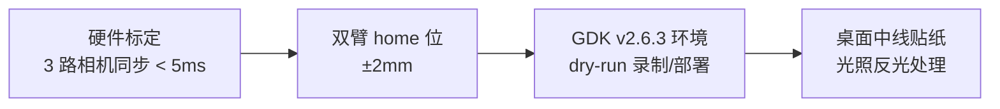
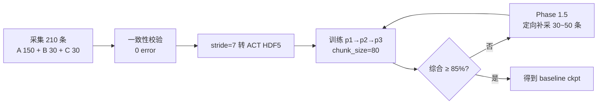
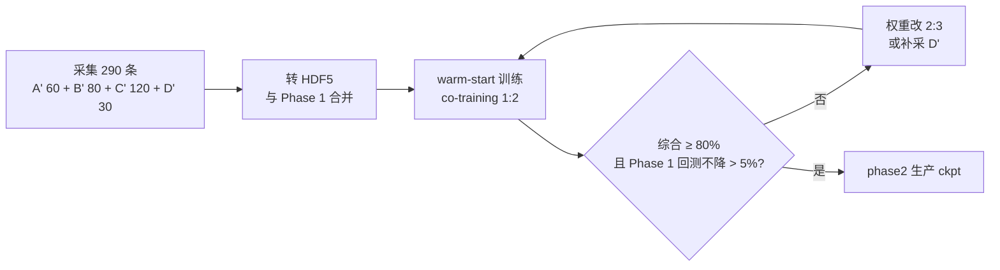
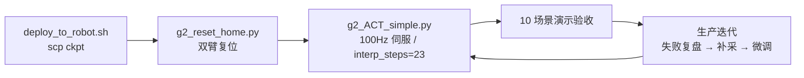

# ACT-plus-plus 堆叠抓取技术路线与行动计划

> **机器人**：Agibot G2（双臂，左臂 7 关节 + 右臂 7 关节 + 2 夹爪 = **16 维 action**），**GDK v2.6.3**。
> **任务**：用 ACT-plus-plus 实现"泡沫 / 塑料袋 / 物料板"在桌面随机姿态下的堆叠抓取。
> **参考项目**：[G2_ACT_全流程文档.md](G2_ACT_全流程文档.md)（同机器人上的 sorting_blocks 成功案例，106M ACT 已在 Thor 跑通）。
> **目标**：9 周内完成从数据采集 → 训练 → Thor aarch64 部署的完整闭环，综合成功率 ≥ 85%。
> **本文档作用**：项目级总览。具体执行细节见各专项 SOP（见 §三 文档索引）。

---

## 一、技术路线总览

### 1.0 全流程图（分段展示）

**① 基础准备阶段**



**② Phase 1 单件闭环**



**③ Phase 2 多件闭环**



**④ Thor 部署与迭代**




### 1.1 关键技术选型

| 维度 | 选择 | 理由 |
|---|---|---|
| 机器人 | Agibot G2 + GDK v2.6.3 | 与 sorting_blocks 任务同一台，重用部署链 |
| Action 维度 | **16**（0:7 左臂 / 7:14 右臂 / 14 左夹爪 / 15 右夹爪） | 与已部署脚本接口一致 |
| 相机 | `hand_left_color` + `hand_right_color` + `head_color`（3 路 480×640） | 与 G2 现有采集镜像一致 |
| 模型 | ACT-plus-plus（CVAE + Transformer + ResNet18，**~106M 参数**） | sorting_blocks 已验证可部署于 Thor |
| 数据频率 | 采集 30Hz → `stride=7` 降采样至 **~4.3Hz**（真实控制频率） | 避免训练到大量 hold 冲淑动作 |
| chunk_size | **80**（≈ 18.6 s @ 4.3Hz） | 堆叠任务动作链长于 sorting_blocks (chunk=20)，需更长 chunk |
| 训练范式 | 多源 co-training + 三段课程 warm-start | 防止主任务被辅助数据覆盖 |
| 防 mode collapse | 硬空间分区（中线左/右）+ 中心带强制右臂 | 双臂任务必备，详见 [ACT模型数采策略.md](ACT模型数采策略.md) §2.6 |
| 部署推理 | 100Hz 伊服插值 + 异步预取下一 chunk + EMA 平滑 | 复用 [g2_ACT_simple.py](g2_ACT_simple.py)（sorting_blocks 最佳版） |

### 1.2 为什么不选 π0.5 / 其他 VLA

- 任务复杂度匹配 ACT 的容量上限，不需要 VLA 的视觉-语言泛化
- 数据量级（几百条）远低于 VLA 所需（几万 ~ 几十万条）
- Thor aarch64 端 ACT 部署成熟，VLA 推理时延和显存压力大

---

## 二、行动计划（按周分解）

### 2.0 8 周甘特图


> 图片由 [scripts/gen_gantt.py](scripts/gen_gantt.py) 生成（2026-05-08 起，共 8 周），可直接复制/粘贴到 PPT / 钉钉 / 飞书。如需调整任务/时间，改脚本里的 `START` 或 `tasks` 表后重跑 `python scripts/gen_gantt.py` 即可。


### 2.1 Week 0：硬件 & 软件准备（3 天）

| 任务 | 文件/命令 | 验收 |
|---|---|---|
| 3 路相机同步标定 | [check_dataset_consistency.py](check_dataset_consistency.py) | 时间戳误差 < 5 ms |
| 双臂 home 位标定 | [g2_reset_home.py](g2_reset_home.py)（复用 sorting_blocks） | 左右误差 ±2 mm |
| 桌面中线物理贴纸 | — | 顶视画面可见 ±5 cm 中心带 |
| 扩展盘目录初始化 | `mkdir -p .../Datas/stack_pickup/stage_{A_single,B_multi_flat,C_two_stack}/{record,act_dataset}` | 写权限 OK |
| GDK v2.6.3 环境检查 | `ssh agi@10.130.96.99 && source ~/app/env.sh` | `joint_servo_control` 可调用 |
| dry-run 录制脚本 | `python record_sim_episodes.py` 产生 1 条 record/ | aligned_joints.h5 + 3 路 h265 完整 |
| dry-run 部署脚本 | `bash deploy_to_robot.sh`（复用 sorting_blocks） | rsync 完成无报错 |
| 光照与反光处理 | 塑料袋哑光喷雾 / 漫反射光源 | 顶视画面无高光斑 |

---

### 2.2 Week 1-2：Phase 1 数据采集（210 条）

按 [数据采集SOP_Phase1_单件.md](数据采集SOP_Phase1_单件.md) 执行：

| Stage | 内容 | 条数 | 时长（按 3 min/条 + 30% 废弃率） |
|---|---|---|---|
| A 单物随机姿态 | 3 物件各 50（左 25 / 右 25） | 150 | ~10 h |
| B 多物无堆叠 | 2~3 件散落，抓 1 件 | 30 | ~2 h |
| C 两层堆叠 | 3 种组合各 10 | 30 | ~2.5 h |
| **合计** | | **210** | **~14-15 h** |

#### Phase 1 录制铁律

1. **中线 ±5 cm** 跳过不录
2. **一次一臂**，episode 中途换臂直接丢弃
3. **自然滑脱**后**同臂**重抓 → 加 `_recov` 后缀保留
4. **故意失败严禁**（不人为捏松、不推物体、不挡相机）
5. 每 10 条抽 1 条回放检查

---

### 2.2.5 数据转换与验证（1 天）

Phase 1 采集完成后、训练启动前必须完成（复用 sorting_blocks 已验证脚本）：

#### 一致性检查

```bash
conda run -n aloha python check_dataset_consistency.py \
  --data_dir /home/liumouyun/extended_storage/liumouyun/Datas/stack_pickup/stage_A_single/record \
  --output_report stack_pickup_phase1_consistency.txt
```

验收：报告中 **0 error**（出错的 episode 列入 `episodes_to_drop.txt` 后重采或剔除）。

#### 转换为 ACT HDF5（stride=7 降采样至 4.3Hz）

```bash
python convert_to_act_hdf5.py \
  --input_dir  /home/liumouyun/extended_storage/liumouyun/Datas/stack_pickup/stage_A_single/record \
  --output_dir /home/liumouyun/extended_storage/liumouyun/Datas/stack_pickup/stage_A_single/act_dataset \
  --cameras hand_left_color hand_right_color head_color \
  --prefix stage_A --stride 7
```

产出 HDF5 结构（与 sorting_blocks 完全一致）：

| 键 | 形状 | 说明 |
|---|---|---|
| `/observations/qpos` | (T, 16) | 14 关节 + 2 夹爪位置 |
| `/observations/qvel` | (T, 16) | 关节速度 |
| `/observations/images/{hand_left,hand_right,head}_color` | (T, 480, 640, 3) | uint8 RGB |
| `/action` | (T, 16) | 动作指令 |

**16 维 action 定义**：`[0:7]` 左臂 / `[7:14]` 右臂 / `[14]` 左夹爪（-0.785 全开 → 0.0 全闭） / `[15]` 右夹爪。

#### 可视化抽查

```bash
python visualize_act_dataset.py --episode 0 --output_dir ./vis_videos_phase1
```

验收：隐检 5–10 条转换后视频，确认画面与关节曲线时序对齐、夹爪开合与画面中抓取动作一致、action 略领先于 qpos。

#### 更新 [constants.py](constants.py) 中的 `episode_len`

取 P95 帧数作为 `episode_len`（sorting_blocks 取了 191）。本任务预期为 400~600（堆叠动作链更长），根据实际转换后统计修改。

---

### 2.3 Week 3：Phase 1 训练（约 5 天 GPU）

[constants.py](constants.py) 已配置三段任务 `stack_pickup_cotrain_p1/p2/p3`，权重分别为 `[3,2,2]` / `[2,2,4]` / `[1,2,4]`。

> **超参根据**：sorting_blocks (chunk=20, 200K steps) 已验证可部署。本任务动作链更长，**chunk_size 升到 80**（≈ 18.6 s @ 4.3Hz），训练轮次采用 epoch 计数（1 epoch = 遍历一遍训练集）。

```bash
mkdir -p /home/liumouyun/extended_storage/liumouyun/checkpoints/stack_pickup
DATA=/home/liumouyun/extended_storage/liumouyun
CKPT=$DATA/checkpoints/stack_pickup

# p1: 打基础（偏 Stage-A）
python3 imitate_episodes.py --task_name stack_pickup_cotrain_p1 \
    --policy_class ACT --chunk_size 80 --kl_weight 10 \
    --hidden_dim 512 --dim_feedforward 3200 \
    --batch_size 8 --num_epochs 2000 --lr 1e-5 --seed 0 \
    --ckpt_dir $CKPT/p1

# p2: 收敛（偏 Stage-C，warm-start 自 p1）
python3 imitate_episodes.py --task_name stack_pickup_cotrain_p2 \
    --policy_class ACT --chunk_size 80 --kl_weight 10 \
    --hidden_dim 512 --dim_feedforward 3200 \
    --batch_size 8 --num_epochs 4000 --lr 1e-5 --seed 0 \
    --ckpt_dir         $CKPT/p2 \
    --resume_ckpt_path $CKPT/p1/policy_last.ckpt

# p3: 优化（保持偏 C，小 lr，warm-start 自 p2）
python3 imitate_episodes.py --task_name stack_pickup_cotrain_p3 \
    --policy_class ACT --chunk_size 80 --kl_weight 10 \
    --hidden_dim 512 --dim_feedforward 3200 \
    --batch_size 8 --num_epochs 2000 --lr 5e-6 --seed 0 \
    --ckpt_dir         $CKPT/p3 \
    --resume_ckpt_path $CKPT/p2/policy_last.ckpt
```

**离线指标**：`policy_best.ckpt` 在 val set 上 L1 loss < 训练集 1.3×；模型体积 ≈ **106 MB**（与 sorting_blocks 106.22M 一致，Thor 已验证可跑）。

---

### 2.4 Week 4：Phase 1 在线评估 + 必要时补采

| 指标 | 目标 | 评估方法 | 不达标处置 |
|---|---|---|---|
| Stage-A 单物成功率 | ≥ 95% | 每物件 20 次随机位姿 | 补采 A 30 条 |
| Stage-B 多物首抓 | ≥ 85% | 3 种组合各 15 次 | 补采 B 20 条 |
| Stage-C 堆叠顶层 | ≥ 80% | 3 种组合各 10 次 | 补采 C 30 条 |
| 自然滑脱自恢复（观测项） | ≥ 50% | 现场 20 次 | 不阻塞验收 |
| **综合成功率** | **≥ 85%** | 加权 | 进 Phase 1.5 补采 30~50 条 |

**Phase 1 验收通过 = 拿到 baseline ckpt** → 进 Phase 2。

---

### 2.5 Week 5-7：Phase 2 数据采集（+290 条）

按 [数据采集SOP_Phase2_多件.md](数据采集SOP_Phase2_多件.md)：

| Stage | 条数 | 核心规则 |
|---|---|---|
| A' 单物巩固（新批次实例） | 60 | 防 Phase 1 能力退化 |
| B' 多散件清桌 | 80 | "由近及远"顺序，连续清桌 |
| C' 散件+堆叠混合 | 120 | "先散后堆"+ 协作剧本 20 条 |
| D' 失败/干扰恢复 | 30 | 多对象场景下的恢复 |
| **合计** | **290** | |

**Phase 2 核心升级**：
- 对象归属判定（每个对象单独按位置判主臂，不再按整张桌面）
- 中线 ±5cm 带从"禁采"改为"**强制右臂**"
- 严格"先散后堆 + 由近及远"顺序
- 一次一臂仍然有效（并行双臂留给 v3）

---

### 2.6 Week 8：Phase 2 训练（warm-start from Phase 1）

需在 [constants.py](constants.py) 新增 `stack_pickup_phase2` task：

```python
'stack_pickup_phase2': {
    'dataset_dir': [
        f'{DATA_ROOT}/stack_pickup_phase1/',
        f'{DATA_ROOT}/stack_pickup_phase2/',
    ],
    'sample_weights': [1, 2],   # 偏 Phase 2 新数据但保留 Phase 1
    'stats_dir': [f'{DATA_ROOT}/stack_pickup_phase2/'],
    'num_episodes': 500,
    'episode_len': 800,
    'camera_names': _STACK_CAMERAS,
}
```

```bash
python3 imitate_episodes.py --task_name stack_pickup_phase2 \
    --policy_class ACT --chunk_size 80 --kl_weight 10 \
    --hidden_dim 512 --dim_feedforward 3200 \
    --batch_size 8 --num_epochs 5000 --lr 1e-5 --seed 0 \
    --ckpt_dir         $CKPT/phase2 \
    --resume_ckpt_path $CKPT/p3/policy_last.ckpt
```

**Phase 1 能力保留检查**：用 Phase 1 评估场景回测，下降 > 5% → 权重改 `[2, 3]` 重训。

---

### 2.7 Week 9：Thor aarch64 部署（复用 sorting_blocks 部署链）

#### 2.7.1 部署环境

| 项 | 值 |
|---|---|
| 机器人 IP | `10.130.96.99` |
| 远程路径 | `/data/agi/liumouyun/act-plus-plus/` |
| Python | `/data/agi/envs/aloha/bin/python`（3.12） |
| GDK | v2.6.3 |
| GPU | Jetson/Thor (aarch64) |

#### 2.7.2 一键部署与运行

```bash
# 本机：同步推理脚本 + 模型代码
bash deploy_to_robot.sh
# 手动 scp 本任务 ckpt
scp -r $CKPT/phase2 agi@10.130.96.99:/data/agi/liumouyun/act-plus-plus/stack_pickup_phase2

# 机器人端
ssh agi@10.130.96.99
source ~/app/env.sh
export LD_LIBRARY_PATH=/data/lxl/Isaac-GR00T/.venv/lib/python3.12/site-packages/nvidia/cu13/lib:/usr/local/cuda-13.0/targets/sbsa-linux/lib:/usr/local/cuda-13.0/lib64:$LD_LIBRARY_PATH
python g2_reset_home.py
python g2_ACT_simple.py \
    --ckpt_dir ./stack_pickup_phase2 \
    --task_name stack_pickup_phase2 \
    --max_chunks 30
```

#### 2.7.3 推理控制关键参数（沿用 sorting_blocks 调优值）

| 参数 | 值 | 说明 |
|---|---|---|
| `SERVO_DT` | 0.01 s | **100Hz** 伊服频率 |
| `interp_steps` | **23** | 每 chunk 步间 23×10ms = 230ms ≈ 1/4.3Hz（必须匹配训练频率） |
| chunk 执行总步数 | 80×23 = 1840 步 = **18.4 s/chunk** | 本任务 chunk_size=80 |
| `ACTION_EMA_ALPHA` | 0.5 | 动作 EMA 平滑系数 |
| `MAX_JOINT_DELTA` | 0.5 rad/step | 单步关节变化上限 |
| 异步预取 | chunk 末尾提前 150ms 启动下一 chunk 推理 | 推理耗时 ~100ms，无缝衔接 |

#### 2.7.4 安全机制（必须开启）

[g2_ACT_simple.py](g2_ACT_simple.py) 内 `safety_clamp` 使用 GDK 真实限位：

| 关节 | 下限 (rad) | 上限 (rad) |
|---|---|---|
| joint1, 3, 5 | -2.880 | 2.880 |
| joint2 | -3.142 | 0.087 |
| joint4 | -2.339 | 0.087 |
| joint6 | -1.677 | 2.077 |
| **joint7** | **-1.536** | **1.536**（超限崩溃重灾区） |
| gripper | -0.785 | 0.0 |

另需保留：`joint_servo_control` `try/except`、失败时不更新 `prev_action`。

#### 2.7.5 演示验收

10 个场景（包含单件/多件/堆叠/中心带）实拍 + 视频归档 + 成功率统计。

---

## 三、关键文档与配置索引

| 文档 | 用途 |
|---|---|
| [G2_ACT_全流程文档.md](G2_ACT_全流程文档.md) | sorting_blocks 成功案例（本项目参考实现） |
| [ACT模型数采策略.md](ACT模型数采策略.md) | 总策略；§2.6 双臂分工规则（防 mode collapse） |
| [数据采集SOP_Phase1_单件.md](数据采集SOP_Phase1_单件.md) | Phase 1 录制 SOP（210 条） |
| [数据采集SOP_Phase2_多件.md](数据采集SOP_Phase2_多件.md) | Phase 2 录制 SOP（+290 条） |
| [constants.py](constants.py) | task 配置（stack_pickup_cotrain_p1/p2/p3 已就绪） |
| [convert_to_act_hdf5.py](convert_to_act_hdf5.py) | 原始采集 → ACT HDF5（`--stride 7`） |
| [check_dataset_consistency.py](check_dataset_consistency.py) | 数据一致性校验（必须 0 error） |
| [visualize_act_dataset.py](visualize_act_dataset.py) | 转换后数据可视化验证 |
| [imitate_episodes.py](imitate_episodes.py) | 训练入口；支持 `--resume_ckpt_path` |
| [utils.py](utils.py#L212) | `BatchSampler` 多源 co-training 实现 |
| [g2_ACT_simple.py](g2_ACT_simple.py) | **机器人端推理主脚本**（sorting_blocks 同一文件，如动作链过长可调 `interp_steps`） |
| [g2_reset_home.py](g2_reset_home.py) | 机器人复位脚本 |
| [deploy_to_robot.sh](deploy_to_robot.sh) | 一键部署脚本 |

---

## 四、风险与应急预案

| 风险 | 触发条件 | 应急 |
|---|---|---|
| 双臂 mode collapse | 单物体推理时两臂同时伸 / 摇摆 | 检查录制是否违反中线规则；推理切先验采样 z |
| Phase 2 训练后 Phase 1 能力下降 > 5% | 回测 Phase 1 评估 | co-training 权重改 `[2, 3]` 重训 |
| 塑料袋反光导致视觉失败 | Stage-A 袋子成功率 < 80% | 加哑光喷雾 / 调漫反射光源 / 补 30 条该物件 |
| 三层堆叠拆解时带倒下层 | Phase 2 Stage-C' 完成率 < 70% | 补采 D' "带倒下层" 失败恢复 15 条 |
| 数据 ≥ 800 条仍 < 85% | 持续补采无效 | 回头查硬件标定/相机同步，不是数据问题 |
| **关节超限崩溃**（sorting_blocks 踩过） | 推理报 `idx27_arm_l_joint7 out of range` | 确保 `safety_clamp` 用 GDK 真实限位（joint7 ±1.536）；`joint_servo_control` 包 try/except |
| **执行速度不匹配**（sorting_blocks 踩过） | 机器人动作太快/太慢 | 保证 `interp_steps × SERVO_DT ≈ 1/训练频率`，本任务 23×0.01=0.23s |
| **夹爪动作滑后**（sorting_blocks 踩过） | 抓取未闭合 / 复位未打开 | 每步都发送夹爪指令（不仅在状态切换时） |
| Thor 推理时延过高 | 推理 > 150ms | 限 chunk_size ≤ 80；异步预取提前量加到 200ms |

---

## 五、里程碑与产出

| 里程碑 | 时间 | 产出物 |
|---|---|---|
| **M1** 硬件就绪 | Day 3 | dry-run 通过 |
| **M2** Phase 1 数据 | Week 2 末 | `stack_pickup_phase1/` 210+ 条，0 error |
| **M3** Phase 1 模型 | Week 4 末 | `policy_best.ckpt`，综合 ≥ 85% |
| **M4** Phase 2 数据 | Week 7 末 | `stack_pickup_phase2/` 290 条 |
| **M5** Phase 2 模型 | Week 8 末 | `phase2/policy_best.ckpt`，综合 ≥ 80% |
| **M6** 上线 | Week 9 末 | Thor 部署 + 10 场景演示视频 |

**总周期 ≈ 9 周**，关键路径在 Phase 1 数据采集（Week 1-2）与 Phase 2 训练验证（Week 8）。

---

## 六、硬约束（贯穿全流程）

引用自 [ACT模型数采策略.md](ACT模型数采策略.md) §2.5：

| 约束 | 数值 | 违反后果 |
|---|---|---|
| Stage-D 占总量比例 | 10% ~ 15% | 超过 → 正常场景也学到抖动 |
| 单一堆叠组合占 Stage-C 比例 | ≤ 40% | 超过 → 过拟合该组合 |
| 同一物体/姿态重复采 | ≤ 5 条 | 超过 → CVAE latent 坍缩 |
| 每轮补采量 | 30 ~ 50 条 | 超过 → 难定位是哪批数据起效 |
| 总数据量上限 | ≤ 800 条 | 超过仍未达标 → 排查硬件 |

---

## 七、Thor 部署后的迭代循环

上线 ≠ 结束。生产环境失败 case 应每周复盘：

```
现场失败 → 录制 30s 上下文 → 标注失败模式 → 定向补采 30 条 → 微调（warm-start）→ 灰度验证 → 全量上线
```

每轮迭代周期 ≈ 1 周，预计 Phase 2 上线后还需 2-3 轮才能稳定到 90%+。
